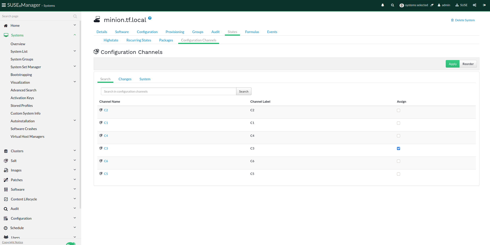
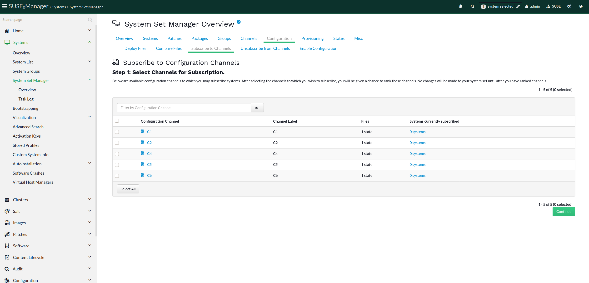
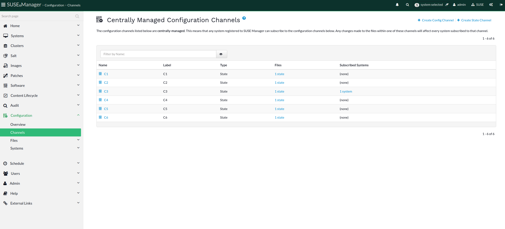

- Feature Name: Enhance visibility of connected Configuration State Channels
- Start Date: 2020-12-17
- RFC PR:

# Summary
[summary]: #summary

Provide visibility of **inherited** Configuration State Channels connections at a System Details level. The reverse information as well should be provided by giving visibility of those systems they are connected (directly or by **inheritance**) to a certain Configuration State Channel at a Channel Details level.

*Note: everything discussed in this RFC applies to Salt clients only. Traditional clients do not inherit Configuration State Channels.*

# Motivation
[motivation]: #motivation

## Why are we doing this?

By definition a Configuration State Channel is a pool of configuration salt states resources. Once a channel of these types is created, it is possible to subscribe systems to it in order to deploy the content of that channel to them. Alternatively, channels can also be assigned to System Groups and/or to Organizations.

Collecting the possibilities as described above, we can see that:
- a channel can be assigned directly to a system `channel --> system`
- a channel can be assigned to a system group `channel --> group`
- a channel can be assigned to an organization `channel --> org`

On top of this it has to be considered that by design a System is part of an Organization `system --> org`, and it can also be part of a System Group `system --> group`.

The final channel assignements result, from a system perspective, can be:
1. `system --> channel`
2. `system --> group --> channel`
3. `system --> org --> channel`

That said, in the current implementation there is no way to figure out which channels are assigned to a system other than the directly assigned ones (1.).

And here it is the problem this RFC is trying to describe to solve: apart from the direct assignment, the System inherits channels (thus the content) from the Organization it is part of, and the same goes for the System Groups he is part of, but this inheritance is not visible in the Web UI nor in the XML RPC API.

Note: in addition to what has been described so far, for what concerns the Configuration State Channels case, behind all the Salt States collected from the channels, there are also a bunch of default Salt States, the ones the server has to supply during the registration of a salt minion client. Those are not *assigned* in any way because they are not part of any Configuration State Channel, they do just exists due to the logic implementation of a client registration using Salt. In the end, those are not visible Salt States anyway, and the System will be affected by them during the registration, so from the System perspective an additional source of Salt States could be defined as directly assigned: a non-manageable source behaving as a Configuration State Channel that will be named *registration-states*.

Adding the latter to the picture:
1. `system --> channel`
2. `system --> group --> channel`
3. `system --> org --> channel`
4. `system --> registration-states`

## What are the use cases?

A complete but simple use case:

1. create an Organization O1
2. create a System Group G1
3. onboard a System S1 as a Salt client in the Organization O1 and System Group G1
4. create a Configuration State Channel C1 assigned to Organization O1
5. create a Configuration State Channel C2 assigned to System Group G1
6. create a Configuration State Channel C3 assigned directly to System S1
7. go to System Detail > States > Configuration Channels > System
8. the C3 channel is listed as an assignment to S1
9. there is no info about C1 nor C2 channels, but because of step 4. 5. in reality S1 will receive not only C3 but also C1 and C2 as inheritance of its own setup, being part of O1 and G1
10. the reverse logic is valid as well, there is no information about systems assigned to channels C1 or C2 in Configuration > Channels > Channel Overview > Systems because. No system is directly assigned to them, but S1 inherits them.

Adding complexity to the scenario described above:

1. create another System Group G2
2. create another System Group G3
3. create a Configuration State Channel C4 at System group G2
4. create a Configuration State Channel C5 at System Group G2
5. create a Configuration State Channel C6 at System Group G3
6. check the following system groups channels assignments:
  - G1 --> C2
  - G2 --> C4
  - G2 --> C5
  - G3 --> C6
7. add the System S1 to System Groups G2 and G3
8. go to System Detail > States > Configuration Channels > System
9. still only the C3 channel is listed as an assignment to S1, but in reality S1 is inheriting C2 from G1, C4 and C5 from G2 and C6 from G3

## What is the expected outcome?

A transparent representation of all Configuration State Channels assigned to a system from all the possible sources: direct and inherited (from System Groups, from Organization and from the system registration).

## Limitation

It turns out that once the Salt States are collected from the various source Configuration States Channels, they are handled by the Salt engine itself who builds up the Salt highstate, and this one has no tracking information of the order or the source of the states origin.

The proposed solution of this RFC is not including an end-to-end description of where each single Salt State comes from where at the moment, the initial improvement is to add the visibility of the set of Configuration State Channels every system inherits from other entities (System Groups and Organizations as described before).

# Detailed design
[design]: #detailed-design

### `Home > My Organization > Configuration Channels`
This page represents the assignment connection between an organization and configuration channels. All the systems in this organization will inherit the selection set of channels here. This should be only a list of Configuration Channels with the possibility of simply select/deselect channels and Apply changes. If there is a need to show only the channel selected, a filter to the list page should be added instead.

Before:

After:

### `Systems > Details > States > Configuration Channels`
Before:

After:

### `Systems > System Groups > Details > States > Configuration Channels`
This page represents the assignment connection between a system group and configuration channels. All the systems in this system group will inherit the selection set of channels here. This should be only a list of Configuration Channels with the possibility of simply select/deselect channels and Apply changes. If there is a need to show only the channel selected, a filter to the list page should be added instead.

Before:

After:

### `Systems > System Set Manager > Overview > Configuration > Subscribe to Channels`
Before:

After:

### `Systems > System Set Manager > Overview > Configuration > Unsubscribe to Channels`
Before:

After:

### `Configuration > Overview`
Before:

After:

### `Configuration > Channels`
Before:

After:

### `Configuration > Channels > Details > Overview`
Before:

After:

### `Configuration > Channels > Details > Systems > Inheriting Systems`
This is a new page where systems are listed only if not subscribed to the channel directly, but inheriting it through Organization or System Group assignment.

Before:

After:

### `Configuration > Channels > Details > System Groups`
This page reproduces the same behavior of the `Configuration > Channels > Details > Systems` tab, but for System Groups.

This **new** page is pointed by:
- the `Channel information` box link of the system groups counting in the `Configuration > Channels > Details > Overview` page: the link will land on the new page at the `Subscribed System Groups` tab

### `Configuration > Channels > System Groups`
This page represents a complete list of pairs value `Configuration State Channel - System Group`: every value is a link to the specific entity detail (channel or system group).

This **new** page is pointed by:
- the `Configuration summary` box link of the system groups counting in the `Configuration > Overview` page: the link will land on the new page where all the pairs `Configuration State Channel - System Group` are listed
- the `Configuration > Channels` list, for every channel entry, from the `Subscribed System Groups` counting link value

# Drawbacks
[drawbacks]: #drawbacks

## Why should we **not** do this?

No real reason for not enhancing the feature adding the missing visibility.

The concrete drawback is: the solution is adding information to a tech-debt affected architecture, spreading the same information in many places (see how many pages/screenshots). Maintaining should not be complicated, but future refactoring of the feature workflow could be more difficult.

# Alternatives
[alternatives]: #alternatives

## What other designs/options have been considered?

Without investigating deeply, the alternative would be redesigning the feature completely from both the design and technical perspectives: the technical refactoring should get rid of the struts stack and redefine the concept of Configuration Channel and Configuration State Channel used by traditional or salt minion clients. By addressing the technical part, also the workflow could be re-drawn, dropping some pages and instead of adding separated tabs of tables it would be preferrable to have unified modern lists of filterable entries. The drawback of this alternative is that it would take much longer (from 3 to 5 times roughly) than the proposed official solution.

# Unresolved questions
[unresolved]: #unresolved-questions

## What are the unknowns?
1. There is a real need for representing `registration-states` (as mentioned before) or they can still stay behind the scene?
2. Salt States coming from Formulas are not yet considered as part of this RFC
3. This RFC is considering presenting all the sources of the Salt States for a given system. The RFC is **not** considering instead to implement a reverse-engineering to pick every Salt State from a given HighState and build the history of the specific source where it came from.

## What can happen if Murphy's law holds true?
1. No periculous path visible at the moment
